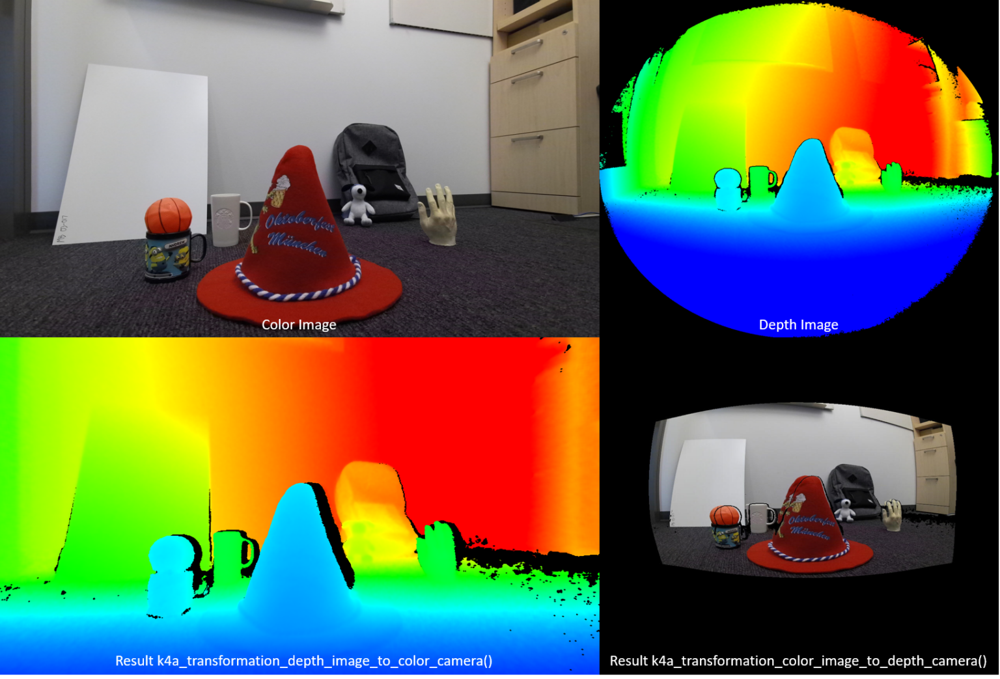

# Orbbec femto bolt 원리 및 설정


<details>
<summary>
 뎁스 센서에 렌즈왜곡되어 들어온 값을 Z값으로 저장하려면 렌즈왜곡을 펼쳐 Z값을 계산해야하지 않나?
</summary>
<br>
 - 질문하신 내용이 수학적으로 매우 날카롭고 정확한 지적입니다!
논리적으로 생각하면 당연히 렌즈 때문에 빛이 휜 각도를 먼저 보정(Undistortion)한 뒤에 픽셀별 삼각측량을 해야 올바른 Z값이 나올 것 같습니다. 하지만 하드웨어 제조사(오르벡, 마이크로소프트 등)가 뎁스맵을 만들어내는 방식은 조금 다릅니다.
오르벡 펨토 볼트가 왜곡을 펴지 않은 상태에서 Z값을 계산해 내는 원리와 그 이유를 명쾌하게 설명해 드리겠습니다.  


------------------------------
## 핵심 요약: "공식을 미리 합쳐두었기 때문"입니다.  
- 실시간으로 30fps~60fps의 고해상도 이미지를 처리할 때, 왜곡 보정(2D 픽셀 이동) ➡️ Z값 계산 순서로 매번 연산을 분리하면 카메라 프로세서에 과부하가 걸립니다. [1] 따라서 공장에서 카메라를 만들 때(Factory Calibration), "이 센서의 (u, v) 픽셀에 들어오는 빛은 렌즈 때문에 이만큼 휘어 들어왔으니, ToF 비행시간이 $T$라면 실제 Z방향 거리는 $Z$다"라는 관계식을 픽셀마다 매핑하여 카메라 내부 메모리에 미리 구워둡니다. [1, 2] 즉, 렌즈 왜곡에 대한 수학적 기하학 정보가 이미 Z값 변환 공식에 통합(상쇄)되어 있는 것입니다.
------------------------------
## 구체적인 연산 과정 비교
이해를 돕기 위해 두 가지 연산 방식을 비교해 보겠습니다.
## 1. 일반적인 2D 이미지의 왜곡 보정 (우리가 생각하는 방식)
보통 OpenCV 등으로 이미지를 펼 때는 다음과 같이 동작합니다.

* 픽셀의 물리적 위치 (u_distorted, v_distorted)를 왜곡 계수를 이용해 원래 있어야 할 바른 위치 (u_rectified, v_rectified)로 재배치(Remap)합니다.
* 이 과정에서 주변 픽셀 간의 값을 채우기 위한 보간법(Interpolation) 연산이 대량으로 발생하여 연산 비용이 큽니다. [3, 4, 5] 

## 2. ToF 카메라의 뎁스맵 생성 방식 (실제 방식)
오르벡 카메라 내부에서는 픽셀을 물리적으로 이동시키는 연산을 하지 않습니다.

* 센서의 위치 고정: (u, v) 번호의 픽셀 센서는 항상 그 자리에 고정되어 있습니다.
* 고유 픽셀 벡터: 해당 픽셀로 들어오는 빛의 실제 대각선 각도(렌즈 왜곡으로 인해 굴절된 최종 각도 $\theta$)는 고정값입니다.
* 한 번에 계산: ToF 센서가 측정한 대각선 거리(Radial Distance, $R$)가 들어오면, 공장에서 구워둔 픽셀별 고유 각도($\theta$)를 이용해 바로 코사인 법칙($Z = R \times \cos\theta$)을 적용합니다.

💡 결과: 픽셀의 2D 위치는 왜곡된 격자 그대로 남아있지만, 그 자리에 적히는 Z값 숫자만큼은 정확한 Z방향 물리 거리가 저장되게 됩니다.

------------------------------
## 왜 굳이 왜곡된 채로 뎁스맵을 줄까요?
"그럼 공식에 다 녹여낼 수 있다면 픽셀 위치까지 다 펴서(Undistorted Depth Map) 주면 안 되나?"라는 의문이 드실 수 있습니다. 제조사가 원시 뎁스맵(Raw Depth Map)을 기본 출력으로 삼는 이유는 2가지입니다. [6] 

   1. 데이터 손실 및 해상도 왜곡 방지: 이미지를 강제로 펴면 외곽부 픽셀이 늘어나거나 흐려지는(Blurring) 현상이 생겨 거리 데이터의 정밀도가 떨어집니다. [5, 7] 
   2. RGB 카메라와의 정렬(Alignment) 효율성: 오르벡 펨토 볼트의 RGB 카메라도 자체적인 렌즈 왜곡을 가지고 있습니다. 3D 공간을 합성할 때는 어차피 Depth ➡️ 3D Point ➡️ RGB 시점으로 재투영해야 하는데, 뎁스맵을 미리 펴놓으면 오히려 계산이 한 단계 더 늘어나고 비효율적이기 때문입니다. [6, 8, 9, 10] 

결론적으로, 지금 보고 계신 뎁스맵의 픽셀 위치는 휘어있지만 안의 숫자는 정확한 Z값이 맞으니 안심하고 계산에 사용하셔도 됩니다.
혹시 이 개념을 바탕으로 점구름(Point Cloud)을 직접 연산하거나 구현하시려는 단계인가요?
이 왜곡된 뎁스맵을 오르벡 SDK로 RGB 이미지와 매칭(D2C Alignment)하는 방법 알아보기픽셀별 고유 각도($\theta$)를 알기 위해 필요한 카메라 매트릭스(Intrinsics) 구조 보기

[1] [https://www.mdpi.com](https://www.mdpi.com/2313-433X/12/2/91)
[2] [https://pmc.ncbi.nlm.nih.gov](https://pmc.ncbi.nlm.nih.gov/articles/PMC5492766/)
[3] [https://github.com](https://github.com/orbbec/OrbbecSDK_v2/issues/155)
[4] [https://dibyendu-biswas.medium.com](https://dibyendu-biswas.medium.com/stereo-camera-calibration-and-depth-estimation-from-stereo-images-29d87bc702f3)
[5] [https://pmc.ncbi.nlm.nih.gov](https://pmc.ncbi.nlm.nih.gov/articles/PMC6413213/)
[6] [https://github.com](https://github.com/orbbec/OrbbecSDK/issues/47)
[7] [https://arxiv.org](https://arxiv.org/html/2608.06853v1)
[8] [https://github.com](https://github.com/orbbec/OrbbecSDK/issues/39)
[9] [https://www.computer.org](https://www.computer.org/csdl/journal/tp/2015/07/06928464/13rRUxlgxUB)
[10] [https://github.com](https://github.com/orbbec/OrbbecSDK_v2/issues/84)

</details>
<br>

<details>
<summary> depth_image_to_color_custom </summary>
<br>

```python
import cv2
import numpy as np
from pyk4a import PyK4A, Config, ColorResolution, DepthMode

# 1. 카메라 설정 및 시작
config = Config(
    color_resolution=ColorResolution.RES_1080P, # 1920x1080 컬러 해상도
    depth_mode=DepthMode.NFOV_UNBINNED,        # 뎁스 모드 설정
    synchronized_images_only=True              # 컬러/뎁스 동기화
)
k4a = PyK4A(config)
k4a.start()

# SDK 내부의 Transformation 클래스 가져오기
transformation = k4a.transformation

try:
    while True:
        capture = k4a.get_capture()
        
        if capture.depth is not None and capture.ir is not None:
            raw_depth = capture.depth
            raw_ir = capture.ir # 뎁스맵과 시점/왜곡이 완벽히 일치하는 원시 IR 이미지
            
            # [핵심] 뎁스맵과 IR 이미지를 동시에 컬러 카메라 시점으로 변환
            # pyk4a에서는 결괏값으로 (변환된 뎁스, 변환된 커스텀) 2개를 튜플로 반환합니다.
            transformed_depth, transformed_ir = transformation.depth_image_to_color_custom(
                depth=raw_depth,
                custom_image=raw_ir,
                interpolation_type=0 # 0: Nearest Neighbor (데이터 원본 유지), 1: Linear (부드럽게)
            )
            
            # IR 이미지 시각화 처리 (8비트 변환)
            ir_vis = cv2.normalize(transformed_ir, None, 0, 255, cv2.NORM_MINMAX, dtype=cv2.CV_8U)
            
            # 이제 transformed_depth와 ir_vis는 모두 컬러 이미지(1920x1080)와 좌표가 완벽히 일치합니다.
            cv2.imshow("Transformed IR (1920x1080)", ir_vis)
            cv2.imshow("Color Image", capture.color)
            
        if cv2.waitKey(1) & 0xFF == ord('q'):
            break
finally:
    k4a.stop()
    cv2.destroyAllWindows()

```
<br>

```python
import cv2
import numpy as np
import sys
from pyorbbecsdk import Pipeline, Config, OBSensorType, OBFormat
from pyorbbecsdk import CoordinateTransformHelper

def main():
    # 1. 파이프라인 및 설정 초기화
    pipeline = Pipeline()
    config = Config()

    # 2. 컬러 스트림 설정 (1920x1080)
    try:
        color_profile = pipeline.get_stream_profile_list(OBSensorType.COLOR_SENSOR).get_video_stream_profile(1920, 1080, OBFormat.MJPEG, 30)
        config.enable_stream(color_profile)
    except Exception as e:
        print(f"컬러 스트림 설정 실패: {e}")
        return

    # 3. 뎁스 스트림 설정 (640x576)
    try:
        depth_profile = pipeline.get_stream_profile_list(OBSensorType.DEPTH_SENSOR).get_video_stream_profile(640, 576, OBFormat.Y16, 30)
        config.enable_stream(depth_profile)
    except Exception as e:
        print(f"뎁스 스트림 설정 실패: {e}")
        return

    # 4. IR(적외선) 스트림 설정 (640x576, 뎁스 카메라와 시점/왜곡이 완전히 동일함)
    try:
        ir_profile = pipeline.get_stream_profile_list(OBSensorType.IR_SENSOR).get_video_stream_profile(640, 576, OBFormat.Y16, 30)
        config.enable_stream(ir_profile)
    except Exception as e:
        print(f"IR 스트림 설정 실패: {e}")
        return

    # 5. 파이프라인 시작
    pipeline.start(config)
    print("스트림이 시작되었습니다. 'q'를 누르면 종료합니다.")

    try:
        while True:
            frameset = pipeline.wait_for_frames(100)
            if frameset is None:
                continue

            color_frame = frameset.get_color_frame()
            depth_frame = frameset.get_depth_frame()
            ir_frame = frameset.get_ir_frame()

            if color_frame is None or depth_frame is None or ir_frame is None:
                continue

            # 6. 컬러 이미지 디코딩 (1920x1080 BGR)
            color_data = color_frame.get_data()
            color_img = cv2.imdecode(np.frombuffer(color_data, dtype=np.uint8), cv2.IMREAD_COLOR)

            # 7. [핵심] CoordinateTransformHelper를 이용한 커스텀 변환 연산
            # 원시 뎁스 프레임과 함께 IR 프레임을 넘겨주면, 컬러 카메라 렌즈 모델에 맞춰 변환된 '새로운 프레임 객체'를 반환합니다.
            transformed_depth_frame, transformed_custom_frame = CoordinateTransformHelper.transformation_depth_frame_to_color_camera_custom(
                pipeline, 
                depth_frame, 
                ir_frame
            )

            if transformed_depth_frame is None or transformed_custom_frame is None:
                continue

            # 8. 변환된 결과물 넘파이 배열로 변환 (모두 컬러 해상도인 1080x1920 구조로 확장됨)
            t_depth_data = transformed_depth_frame.get_data()
            transformed_depth = np.frombuffer(t_depth_data, dtype=np.uint16).reshape((1080, 1920))

            t_ir_data = transformed_custom_frame.get_data()
            transformed_ir = np.frombuffer(t_ir_data, dtype=np.uint16).reshape((1080, 1920))

            # 9. 시각화 처리 (OpenCV 출력을 위한 8비트 정규화)
            # 변환된 뎁스 맵 시각화
            depth_vis = np.clip(transformed_depth, 0, 4000) / 4000.0 * 255.0
            depth_colormap = cv2.applyColorMap(depth_vis.astype(np.uint8), cv2.COLORMAP_JET)

            # 변환된 IR 이미지 시각화 (16비트 데이터를 8비트로 압축)
            ir_vis = cv2.normalize(transformed_ir, None, 0, 255, cv2.NORM_MINMAX, dtype=cv2.CV_8U)

            # 10. 화면 출력 (컬러, 정렬된 뎁스, 정렬된 IR 이미지의 모든 좌표가 1:1로 일치함)
            cv2.imshow("Color Image (1920x1080)", color_img)
            cv2.imshow("Transformed Depth (1920x1080)", depth_colormap)
            cv2.imshow("Transformed IR Custom (1920x1080)", ir_vis)

            if cv2.waitKey(1) & 0xFF == ord('q'):
                break

    except KeyboardInterrupt:
        print("종료되었습니다.")
    finally:
        pipeline.stop()
        cv2.destroyAllWindows()

if __name__ == "__main__":
    main()

```
</details>
<br>

<details>
<summary>depth invalidations 를 사용하는 방법은?</summary>
  
- 오르벡 펨토 볼트(Orbbec Femto Bolt)에서 Depth Invalidations(깊이 무효화)는 카메라의 뎁스 엔진이 신뢰할 수 없다고 판단한 불량 픽셀을 0값으로 처리하여 자동으로 걸러내는 하드웨어 및 SDK의 보호 메커니즘입니다. [1] 
개발자가 이를 '사용한다'는 것은 ① 무효화 처리된 0값 픽셀들을 분석하여 예외 처리(마스킹)하는 방식과, ② SDK 필터를 통해 무효화 원인을 보정하여 다시 유효한 값으로 복원하는 방식 두 가지를 의미합니다.
------------------------------
## 1. 코드단에서 무효화 데이터(0) 예외 처리하기 (알고리즘 보호)
로봇 공학, 3D 점구름(Point Cloud) 생성, 거리 측정 알고리즘을 짤 때 무효화된 0값을 그대로 연산에 넣으면 평균값이 왜곡되거나 치명적인 오류가 발생합니다. 파이썬 넘파이(NumPy) 매트릭스를 활용해 이를 마스킹해야 합니다.

```python
# depth_data는 pyorbbecsdk에서 가져온 uint16 배열
# 1. 유효한 데이터만 골라내기 (0이 아닌 픽셀만 true)
valid_mask = (depth_data > 0)

# 2. 무효화(Invalid)된 데이터만 골라내기 (0인 픽셀)
invalid_mask = (depth_data == 0)

# 3. 활용 예시: 무효화된 픽셀을 제외한 '진짜 물체들'의 평균 거리 계산
if np.any(valid_mask):
    mean_distance = np.mean(depth_data[valid_mask])
    print(f"무효화 픽셀을 제외한 평균 거리: {mean_distance:.2f} mm")

# 4. 활용 예시: OpenCV 시각화 시 무효화된 영역(0)을 검은색이나 특정 색으로 박스 처리
depth_vis = cv2.normalize(depth_data, None, 0, 255, cv2.NORM_MINMAX, dtype=np.uint8)
depth_vis[invalid_mask] = 0 # 무효화된 곳은 완전한 검은색으로 고정

```

------------------------------
## 2. SDK 포스트 프로세싱 필터로 무효화 영역 줄이기 (데이터 복원)
무효화(0)가 발생하는 주요 원인은 IR 신호 포화(너무 가까움), 신호 저하(너무 멂), 단차 오클루전, 다중 경로 간섭 등입니다. 오르벡 SDK의 내장 필터를 활성화하면 이 무효화 영역을 주변 값으로 채워 정상화할 수 있습니다. [1, 2] 

```python
# pipeline.start(config) 이후 필터 오브젝트 생성 및 적용

# 방법 A: 공간 필터 (Spatial Filter) 적용
# 무효화된 0값 구멍 주변의 유효한 픽셀 값을 부드럽게 채워(Interpolation) 줍니다.
spatial_filter = pipeline.get_filter("SpatialFilter") # SDK 버전에 따라 명칭 확인
if spatial_filter:
    spatial_filter.set_enable(True)

# 방법 B: 시간 필터 (Temporal Filter) 적용
# 프레임이 움직일 때 순간적으로 발생하는 무효화(Invalidation) 에러를 
# 이전 프레임의 유효했던 값을 기억해 매끄럽게 이어붙여 줍니다.
temporal_filter = pipeline.get_filter("TemporalFilter")
if temporal_filter:
    temporal_filter.set_enable(True)

```
------------------------------
## 3. 오르벡 뷰어(Orbbec Viewer)에서 수동 제어 및 디버깅
코드를 작성하기 전, 무효화 현상의 원인을 시각적으로 파악하는 가장 좋은 방법입니다.

   1. Orbbec Viewer 프로그램을 실행하고 카메라는 연결합니다. [3] 
   2. 우측 설정 창에서 Depth Engine → Post Processing 탭으로 이동합니다.
   3. 다양한 필터들 중 False Positive Filter (Edge Bleed, Pattern Ambiguity 등) 설정을 체크해 봅니다.
   * 이 필터들을 켜고 끄는 것에 따라 화면에서 실시간으로 구멍(검은색 무효화 영역)이 뚫리거나 메워지는 현상을 눈으로 직접 확인하며 상용화 세팅 값을 도출할 수 있습니다. [2, 4] 
   
------------------------------
## 💡 핵심 요약

* Depth Invalidation 자체는 카메라가 에러를 방지하기 위해 던지는 0값 신호입니다.
* 데이터 신뢰성이 최우선인 제어 알고리즘 단계에서는 depth_data == 0을 철저히 무시(Ignore)해야 합니다.
* 시각적인 꽉 찬 화면이나 3D 스캔 품질이 최우선일 때는 Spatial/Temporal Filter를 켜서 무효화 영역을 강제로 메워 사용합니다. [1, 5] 

------------------------------
넘파이(NumPy)를 이용해 뎁스 맵의 무효화(0) 픽셀 주변만 골라 채워 넣는 커스텀 Inpainting 알고리즘 보기Femto Bolt에서 물체 재질(반사율) 때문에 발생하는 무효화 현상 줄이는 노출 설정법 알아보기

[1] [https://doc.orbbec.com](https://doc.orbbec.com/documentation/Orbbec%20Femto%20Bolt%20Documentation/Depth%20Camera%20%28Femto%20Bolt%29)
[2] [https://www.orbbec.com](https://www.orbbec.com/lingbot-enhanced-depth-filter/)
[3] [https://www.orbbec.com](https://www.orbbec.com/docs/g330-troubleshooting/)
[4] [https://doc.orbbec.com](https://doc.orbbec.com/documentation/Orbbec%20Gemini%20330%20Series%20Documentation/Detailed%20Filter%20Reference)
[5] [https://github.com](https://github.com/orbbec/pyorbbecsdk/issues/149)


</details>
<br>

<details>
<summary>오르벡 펨토볼트에서 higher modulation frequency 사용하려면</summary>

 - 오르벡 펨토 볼트(Orbbec Femto Bolt)는 iToF(진폭 변조 연속파, AMCW) 방식을 사용하기 때문에, 변조 주파수(Modulation Frequency)가 높을수록 뎁스의 정밀도(정밀한 단차 구분 등)가 비약적으로 상승합니다. [1, 2] 
하지만 사용자가 주파수 수치를 Hz 단위로 직접 입력하는 방식이 아니라, SDK에서 제공하는 Depth Working Mode(깊이 동작 모드)를 변경하여 장거리용(낮은 주파수) 또는 단거리 고정밀용(높은 주파수) 주파수 설정을 하드웨어에 적용해야 합니다. [3, 4] 
파이썬 라이브러리(pyorbbecsdk)에서 상위 변조 주파수를 사용하는 고정밀 모드로 전환하는 방법과 코드 구현을 안내해 드립니다. [5] 

------------------------------

## 1. 펨토 볼트의 주요 뎁스 모드 특징
펨토 볼트는 렌즈의 화각(FoV)과 측정 거리에 따라 주파수 조합이 하드웨어 내부적으로 매핑되어 있습니다. [6] 

* NFOV BINNED / UNBINNED (좁은 화각, 단거리 고정밀)
* 💡 Higher Modulation Frequency 적용 모드
   * 주파수가 높게 세팅되어 단차 정밀도와 측정 분해능이 가장 뛰어납니다.
   * 추천 모드: NFOV_UNBINNED (640x576 해상도에서 픽셀 결합 없이 미세한 굴곡까지 묘사 가능). [7] 
* WFOV BINNED / UNBINNED (넓은 화각, 장거리용)
* 거리를 멀리 보내기 위해 비교적 낮은 변조 주파수를 배합하여 사용합니다. 광범위한 공간 스캔에는 유리하나 정밀 단차 영역에서는 다중 경로 간섭이나 노이즈가 더 생길 수 있습니다. [7] 

------------------------------
## 2. 파이썬 코드 구현 방법 (pyorbbecsdk)
카메라 제어 권한을 가진 device 객체를 파이프라인에서 얻어온 후, set_depth_work_mode() 함수를 통해 고정밀 주파수 모드로 강제 변환해야 합니다. [3] 

```python
import sys
from pyorbbecsdk import Pipeline, Config, OBSensorType, OBDepthWorkMode

def switch_to_high_precision_mode():
    pipeline = Pipeline()
    
    # 1. 연결된 장치(Device) 정보 가져오기
    try:
        device = pipeline.get_device()
    except Exception as e:
        print("카메라가 연결되어 있지 않거나 인식이 안 됩니다.", e)
        return

    # 2. 카메라가 지원하는 Depth Working Mode 목록 확인
    try:
        mode_list = device.get_depth_work_mode_list()
        if mode_list:
            print("=== 사용 가능한 뎁스 모드 목록 ===")
            for i in range(mode_list.get_count()):
                mode = mode_list.get_mode(i)
                print(f"Index {i}: {mode.get_name()}")
            
            # 3. Higher Modulation Frequency가 작동하는 NFOV 고정밀 모드 찾기
            # 보통 Femto Bolt는 모드 이름에 'NFOV' 또는 'Hand' 등이 포함된 모드가 주파수가 높습니다.
            target_mode_index = -1
            for i in range(mode_list.get_count()):
                mode_name = mode_list.get_mode(i).get_name().upper()
                if "NFOV_UNBINNED" in mode_name: # 가장 정밀한 단거리 전용 모드
                    target_mode_index = i
                    break
            
            if target_mode_index != -1:
                # 4. 하드웨어에 고주파수 모드 적용
                device.set_depth_work_mode(mode_list.get_mode(target_mode_index))
                print(f"\n=> 성공: 고정밀 주파수 모드({mode_list.get_mode(target_mode_index).get_name()})로 변경되었습니다.")
            else:
                print("\n원하는 NFOV 고정밀 모드를 찾지 못해 기본 모드를 유지합니다.")
                
    except Exception as e:
        print("뎁스 모드 설정 중 오류 발생:", e)
        return

    # 5. 이후 config 설정 및 스트리밍 시작 (이전 코드와 동일)
    config = Config()
    # NFOV_UNBINNED의 표준 해상도인 640x576 스트림 프로필 매칭 필요
    # pipeline.start(config) ...
```

------------------------------
## ⚠️ 실무 적용 시 필수 주의사항

   1. 측정 제한 거리 감소 (Ambiguity Distance)
   * ToF 센서 특성상 변조 주파수가 높아지면(Higher Frequency), 파장이 짧아져서 측정 가능한 최대 거리가 짧아집니다 (예: WFOV 모드에서 5m까지 나오던 거리가 NFOV 고정밀 모드에서는 2.5m 내외로 축소). 대상 물체를 카메라와 비교적 가깝게 배치해야 합니다. [7] 
   2. 해상도 프로필(Config) 불일치 에러
   * 코드단에서 NFOV_UNBINNED로 뎁스 모드를 바꿨다면, 이후 config.enable_stream()을 선언할 때 반드시 해당 모드가 지원하는 해상도인 640, 576, OBFormat.Y16, 30 프로필을 넣어주어야 파이프라인 에러가 나지 않습니다. [8] 
   3. 가장 확실한 테스트 방법 (Orbbec Viewer)
   * 코딩 전에 오르벡 공식 뷰어 프로그램([Orbbec Viewer](https://github.com/orbbec/pyorbbecsdk))을 켜고, 우측 설정 패널의 Depth Settings -> Depth Work Mode 콤보박스를 통해 NFOV Unbinned 혹은 NFOV Binned로 마우스 클릭 전환해 보며 단차 노이즈가 실제로 얼마나 억제되는지 직관적으로 먼저 확인해 보시는 것을 권장합니다. [4, 9] 
   
혹시 모드 전환 코드 작성 중 AttributeError가 발생하거나 장치 제어(Device Control) 함수명이 빌드 버전과 달라 어려움을 겪고 계신다면 편하게 말씀해 주세요.
오르벡 SDK에서 device 객체를 안전하게 해제(Release)하는 파이썬 예시 보기고주파수 모드에서 발생하는 거리 왜곡(Phase Unwrapping 에러) 현상 해결법 알아보기

[1] [https://doc.orbbec.com](https://doc.orbbec.com/documentation/Orbbec%20Femto%20Bolt%20Documentation/Depth%20Camera%20%28Femto%20Bolt%29)
[2] [https://doc.orbbec.com](https://doc.orbbec.com/documentation/Orbbec%20Femto%20Bolt%20Documentation/Depth%20Camera%20%28Femto%20Bolt%29)
[3] [https://github.com](https://github.com/orbbec/pyorbbecsdk)
[4] [https://orbbec.github.io](https://orbbec.github.io/pyorbbecsdk/)
[5] [https://orbbec.github.io](https://orbbec.github.io/pyorbbecsdk/)
[6] [https://openelab.io](https://openelab.io/blogs/learn/orbbec-femto-bolt-development-guide)
[7] [https://www.orbbec.com](https://www.orbbec.com/asia-pacific/femto-bolt-ad-south-korea/)
[8] [https://manuals.plus](https://manuals.plus/ko/orbbec/femto-bolt-multi-mode-depth-and-rgb-camera-manual)
[9] [https://github.com](https://github.com/orbbec/OrbbecSDK_v2/blob/main/docs/tutorial/orbbecviewer.md)

</details>
<br>