## 인공지능 비전 인식(6D Pose Estimation) 알고리즘 구현

https://ds-apprendre.tistory.com/23
https://vds.sogang.ac.kr/wp-content/uploads/2025/06/2025-%EC%97%AC%EB%A6%84%EC%84%B8%EB%AF%B8%EB%82%98_%EA%B9%80%EC%88%98%ED%9B%88.pdf

https://www.ias.informatik.tu-darmstadt.de/uploads/Team/JoaoCarvalho/meier_multiobject6dpose.pdf
https://ethanswinery.tistory.com/128
https://arxiv.org/html/2508.13775v1
https://arxiv.org/abs/2602.05555

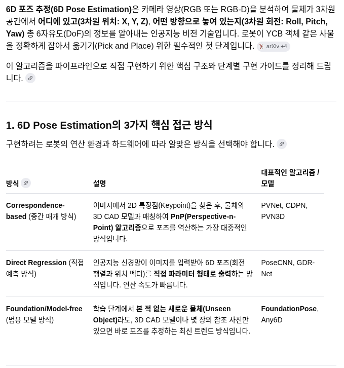

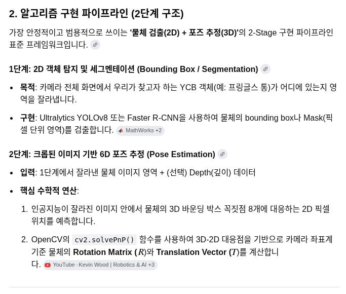

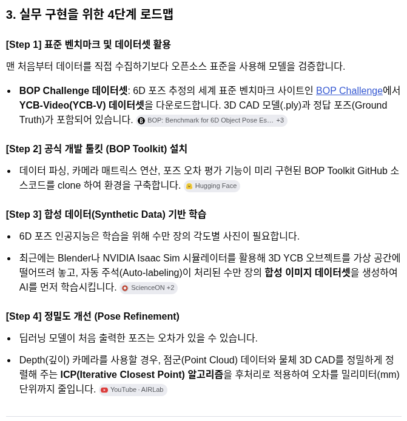

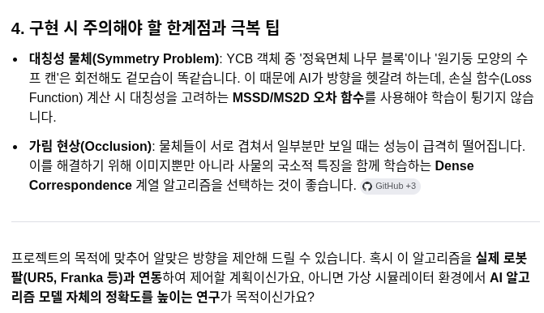

## 산업현장에서 박스에 담긴 동일한 볼트를 픽킹할 수있는 가장 많이 사용되는 알고리즘은

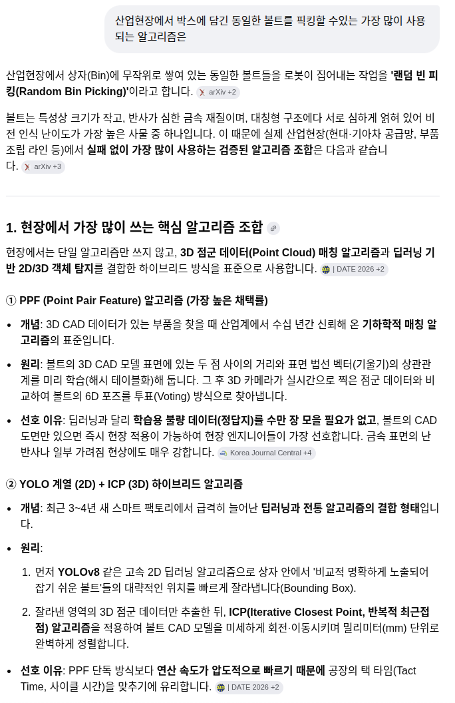
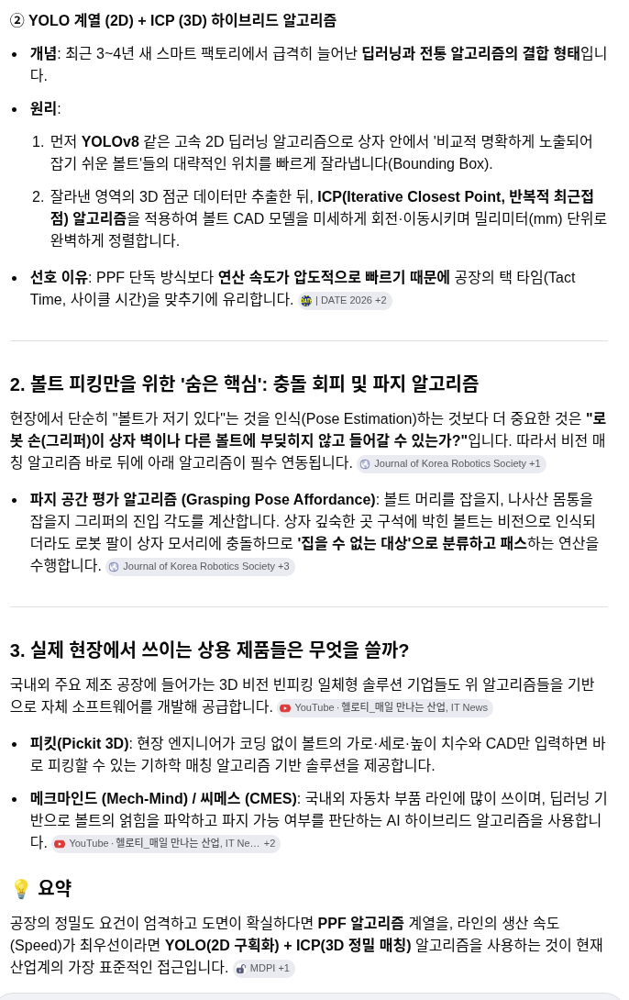

## DenseFusion
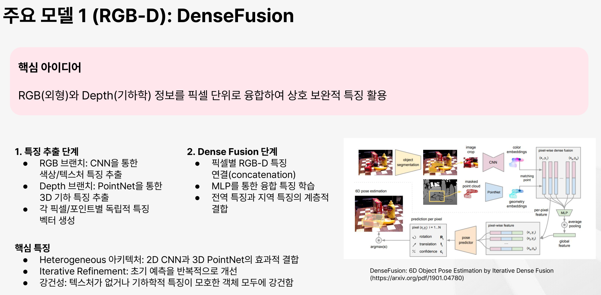

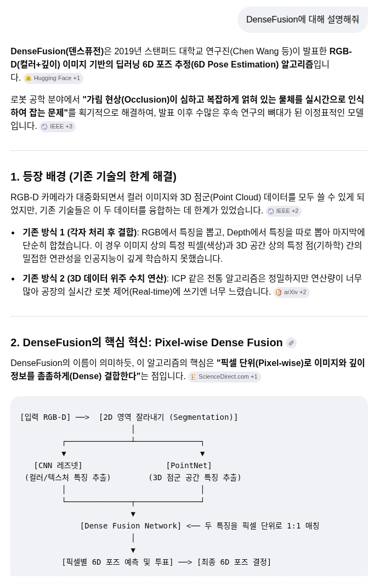
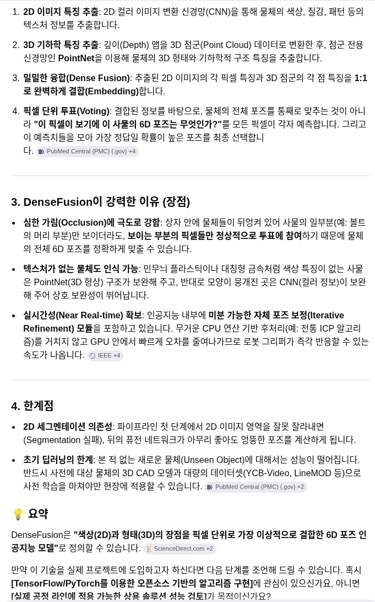

## DenseFusion, PPF 알고리즘, YOLO(2D 구획화) + ICP(3D 정밀 매칭)  이들 중 요즘 많이 쓰이는 방법은?

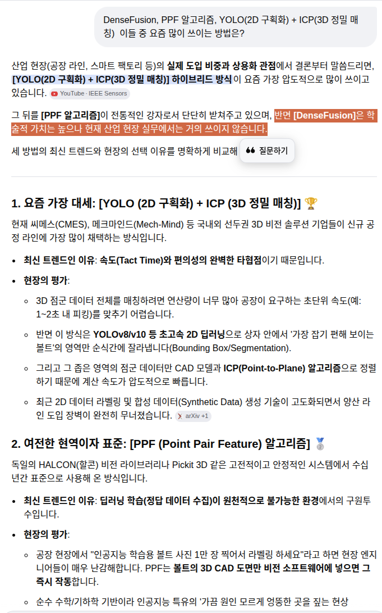
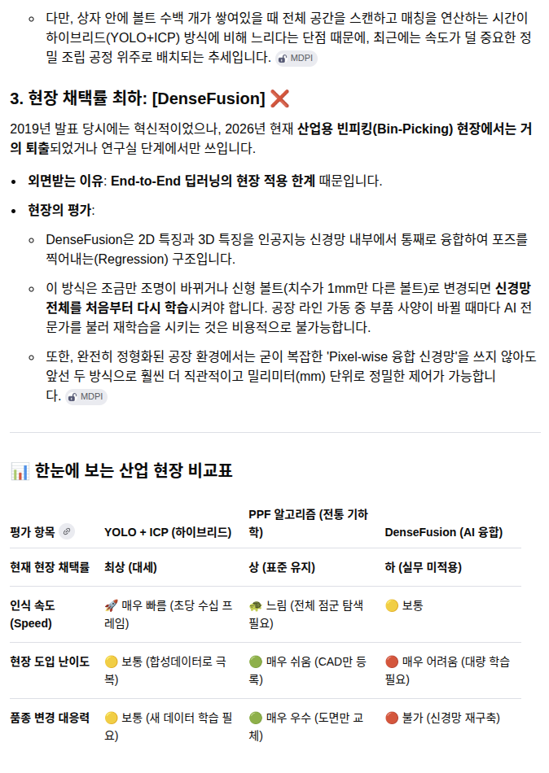
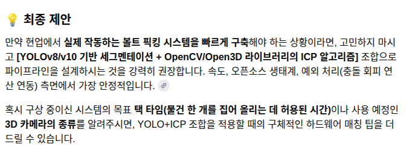

## 메크마인드 비전에서 데이터를 저장하면 2d RGB이미지와 2d형태의 depth 이미지로 저장되고 프로그램에서는 2d형태의 depth 이미지에서 3d 포인트를 뽑아내는 것 같은데 맞나? 그렇다면 왜그런거야?

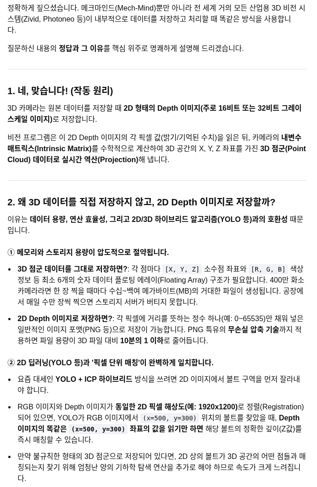

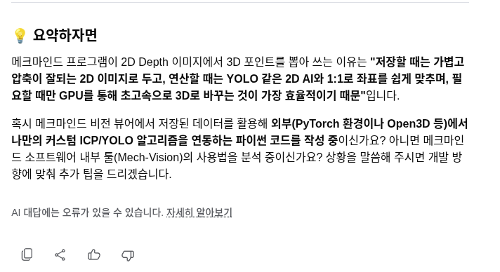
