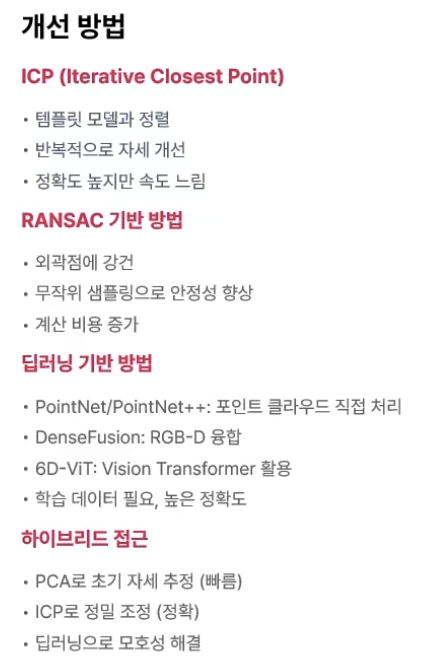
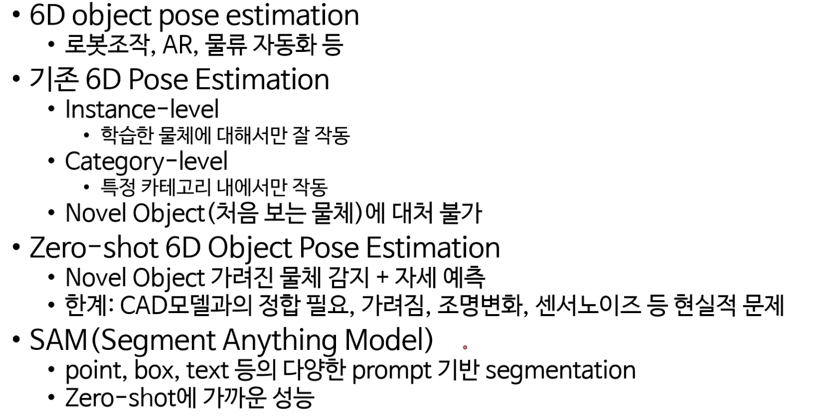
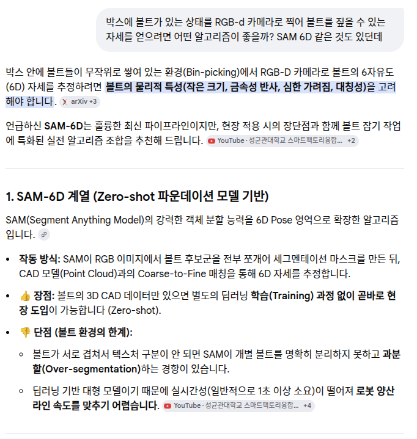
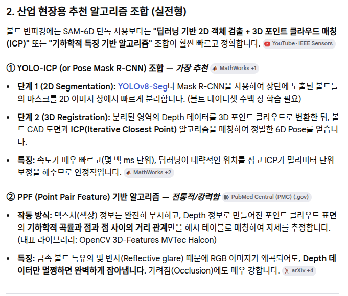
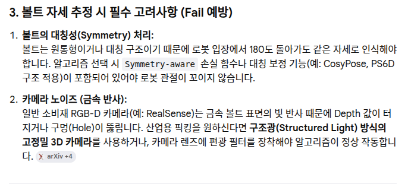
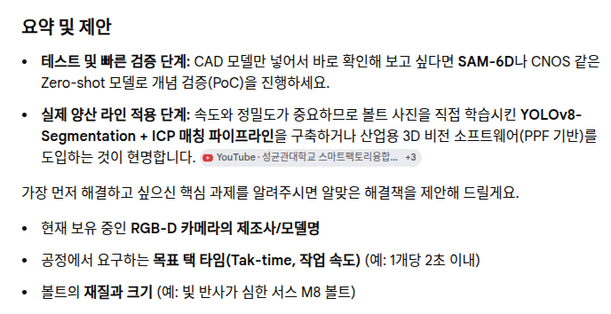
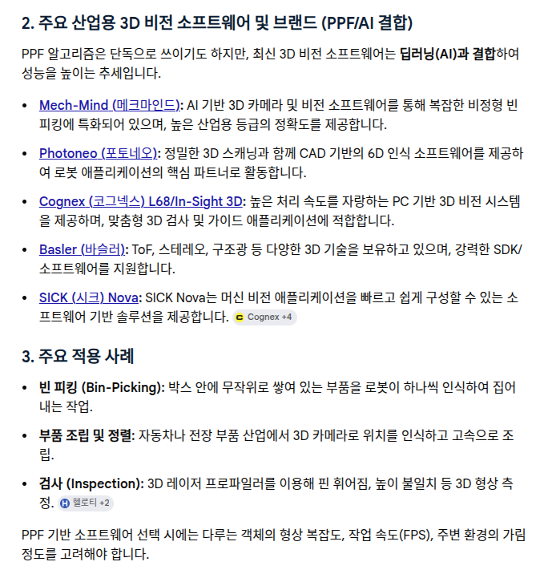
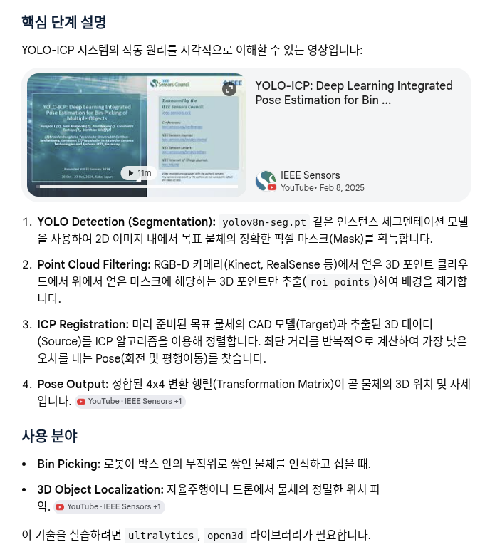

## 개발 전략

1. Perception : 전처리 및 3D 데이터 생성
  - 포인트 클라우드 생성(structured light 또는 stereo vision)
  - 노이즈 제거 및 필터링

2. Object Recognition & Pose Estimation (물체 인식 및 자세 추정)
  - instance segmentation
  - 3D point matching과 딥러닝 기반 분할을 결합한 비전 전략
  - 시나리오에 따른 객체 자세 조정(이건 룰 기반)

  - 이를위해 사전에 객체 포인트 클라우드 모델을 생성(STL model로부터 생성)하고
    사전 학습된 딥러닝 모델 패키지 준비


## Point cloud 라이브러리 관련 정보
 - https://pcl.gitbook.io/tutorial/part-0/part00-chapter01
 - PLC vs OPEN3D
 - 

## 카메라 : ZED
ZED는 주로 물류 자동화(박스 디팔레타이징), 로봇의 자율 주행(SLAM), 대형 부품의 위치 파악 등 비교적 넓은 영역(중/장거리)을 보는 용도로 많이 쓰입니다

## Point cloud 객체에서 방향을 알아내는 방법들




https://www.youtube.com/watch?v=eSFdqBNrNzU










## YOLO + ICP 결합 파이프라인 예제 (Python)
YOLO(객체 탐지)와 ICP(Iterative Closest Point, 3D 점군 정합)를 결합하면 2D 이미지에서 물체를 탐지하고, 3D 포인트 클라우드(LiDAR 또는 RGB-D)에서 해당 물체의 정확한 위치와 자세(Pose)를 추정할 수 있습니다.
일반적으로 [YOLOv8/v11]을 사용해 관심 객체(ROI)를 찾고, 해당 영역의 3D 데이터만 잘라내어 CAD 모델과 [Open3D ICP]로 정합하는 방식이 사용됩니다

```bash
import cv2
import open3d as o3d
import numpy as np
from ultralytics import YOLO

# 1. YOLOv8로 객체 탐지 및 마스크 획득
model = YOLO('yolov8n-seg.pt') # Segmentation 모델 사용
rgb_image = cv2.imread('scene_color.png')
results = model(rgb_image)

# 첫 번째 탐지된 객체의 마스크 가져오기
mask = results[0].masks.data[0].cpu().numpy()
mask = cv2.resize(mask, (rgb_image.shape[1], rgb_image.shape[0]))

# 2. RGB-D 데이터로부터 Point Cloud 생성
depth_image = o3d.io.read_image('scene_depth.png')
color_raw = o3d.geometry.Image(cv2.cvtColor(rgb_image, cv2.COLOR_BGR2RGB))
rgbd_image = o3d.geometry.RGBDImage.create_from_color_depth(
    color_raw, depth_image, convert_rgb_to_intensity=False)

# 카메라 내장 파라미터 (실제 카메라 값 필요)
pcd = o3d.geometry.PointCloud.create_from_rgbd_image(
    rgbd_image,
    o3d.camera.PinholeCameraIntrinsic(
        o3d.camera.PinholeCameraIntrinsicParameters.PrimeSenseDefault))

# 3. 마스크를 이용해 ROI 3D 포인트 클라우드 추출
points = np.asarray(pcd.points)
colors = np.asarray(pcd.colors)
# 마스크 기반 필터링 (간략화된 예시)
roi_points = points[mask.flatten() > 0.5]
source_pcd = o3d.geometry.PointCloud()
source_pcd.points = o3d.utility.Vector3dVector(roi_points)

# 4. CAD 모델(Target) 불러오기
target_pcd = o3d.io.read_point_cloud("object_cad_model.ply")

# 5. ICP 정합 수행 (Pose Estimation)
# 초기 변환 행렬 (일반적으로 YOLO가 준 대략적 위치)
init_trans = np.eye(4)
reg_p2p = o3d.pipelines.registration.registration_icp(
    source_pcd, target_pcd, 0.02, init_trans,
    o3d.pipelines.registration.TransformationEstimationPointToPoint())

print("최종 변환 행렬:\n", reg_p2p.transformation)

# 6. 결과 시각화
source_pcd.transform(reg_p2p.transformation)
o3d.visualization.draw_geometries([source_pcd, target_pcd])
'''

